# Notification & Alarm Architecture

This document describes how PomoDojo handles notifications and alarms across platforms. The flow
starts from `PomodoroSessionViewModel` in the shared layer and branches into platform-specific
implementations via the `PomodoroSessionNotifier` interface.

---

## High-Level Overview

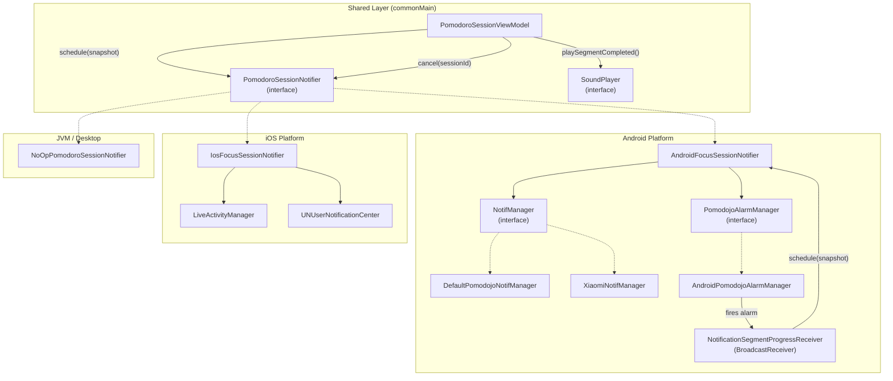

---

## ViewModel → Notifier Flow

The `PomodoroSessionViewModel` triggers notifications and alarms through two methods on
`PomodoroSessionNotifier`:

- **`schedule(snapshot)`** — Creates/updates the notification with current session state.
- **`cancel(sessionId)`** — Dismisses the notification and cancels any pending alarms.

```mermaid
flowchart TD
    subgraph ViewModel["PomodoroSessionViewModel"]
        RESTORE["restoreOrStartSession()"]
        TICK["handleTick()"]
        TOGGLE["togglePauseResume()"]
        COMPLETE["completeActiveSession()"]
        NOTIF["updateNotification()"]
    end

    subgraph Throttle["Notification Throttle"]
        FORCE{"forceUpdate?"}
        THROTTLE{"now - lastUpdated\n≤ 5000ms?"}
    end

    subgraph Notifier["PomodoroSessionNotifier"]
        SCHEDULE["schedule(snapshot)"]
        CANCEL["cancel(sessionId)"]
    end

    RESTORE -- " after preparing session " --> NOTIF
    TICK -- " segment advanced " --> NOTIF
    TOGGLE -- " pause/resume " --> NOTIF
    NOTIF -- " session complete? " --> |Yes|CANCEL
NOTIF -- " session active " --> FORCE
FORCE -->|Yes|SCHEDULE
FORCE -->|No|THROTTLE
THROTTLE -->|Yes, skip|SKIP["Return (throttled)"]
THROTTLE -->|No|SCHEDULE

COMPLETE --> CANCEL
COMPLETE -- " resetNotificationThrottle() " --> RESET["lastUpdated = 0"]
```

### When `updateNotification()` Is Called

| Trigger                           | `forceUpdate` | Notes                                   |
|-----------------------------------|---------------|-----------------------------------------|
| `restoreOrStartSession()`         | `false`       | Initial session load/restore            |
| `togglePauseResume()`             | `true`        | Immediate update on pause/resume        |
| `handleTick()` (segment advanced) | `true`        | Immediate update when segment completes |

### Throttle Logic

To avoid flooding the notification system, `updateNotification()` throttles non-forced updates to
**at most once per 5 seconds** (`TICK_UPDATE_NOTIF_INTERVAL_MILLIS = 5_000L`).

---

## Android Platform

### Architecture

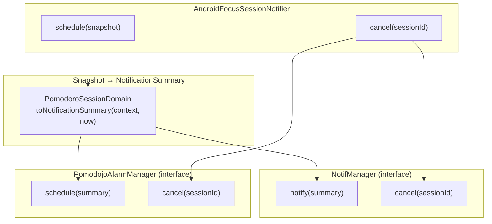

### NotifManager Implementations

There are two `NotifManager` implementations, selected based on device manufacturer:

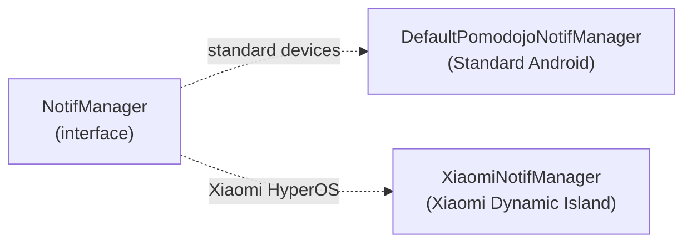

#### DefaultPomodojoNotifManager

- Creates a notification channel (`focus_session_channel`).
- Displays an **ongoing, silent notification** with:
    - Progress bar (`segmentProgressPercent`).
    - Chronometer countdown (when running, using `setWhen(finishTimeMillis)`).
    - BigTextStyle with the motivational quote.
- Uses `PRIORITY_MAX` for persistent visibility.

#### XiaomiNotifManager

- Uses `HyperIslandNotification.Builder` for **Xiaomi Dynamic Island** integration.
- Sends countdown timer via `TimerInfo` and `setBigIslandCountdown(finishTimeMillis)`.
- Wraps notification extras with `miui.focus.param` JSON payload.

### Alarm Manager (Android)

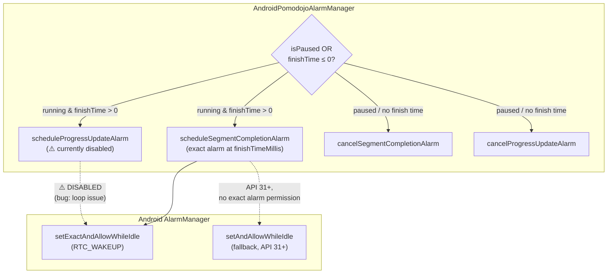

> **Note:** Progress update alarms are currently **disabled** (commented out in
> `AndroidPomodojoAlarmManager`) due to a known bug where they loop the notification update
> continuously.

### Broadcast Receiver Flow

When the alarm fires, `NotificationSegmentProgressReceiver` handles the intent:

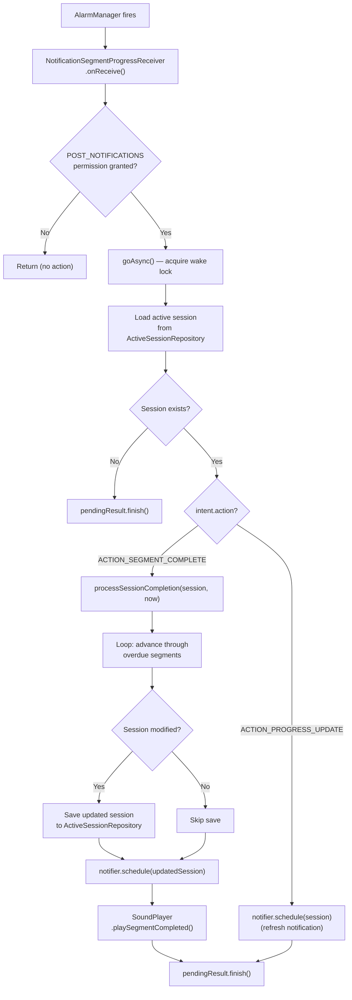

#### Segment Completion Processing

`processSessionCompletion()` handles the case where the alarm fires and the current segment's
remaining time has reached zero. It **loops through all overdue segments** to catch up if multiple
alarms were missed:

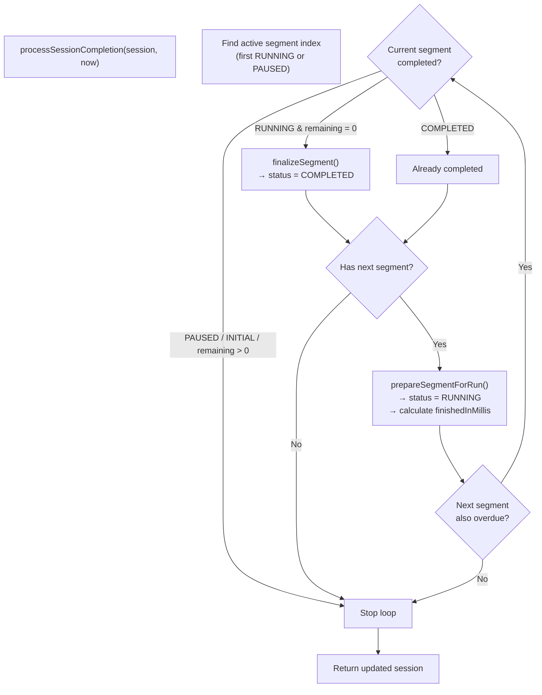

### Android Request Code Scheme

| Purpose                    | Formula                                |
|----------------------------|----------------------------------------|
| Session notification ID    | `42_000 + sessionId.hashCode()`        |
| Segment completion alarm   | `42_000 + 1000 + sessionId.hashCode()` |
| Progress update alarm      | `42_000 + 2000 + sessionId.hashCode()` |
| Completion notification ID | `42_000 + 3000 + sessionId.hashCode()` |
| Xiaomi Dynamic Island ID   | `42_000 + 4000 + sessionId.hashCode()` |

---

## iOS Platform

### Architecture

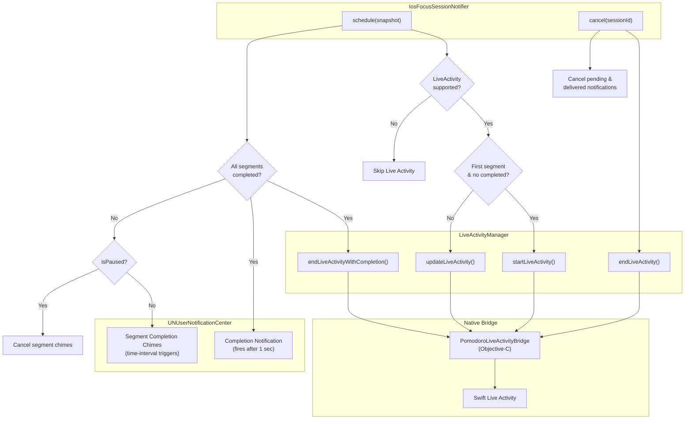

### iOS Schedule Flow (Detailed)

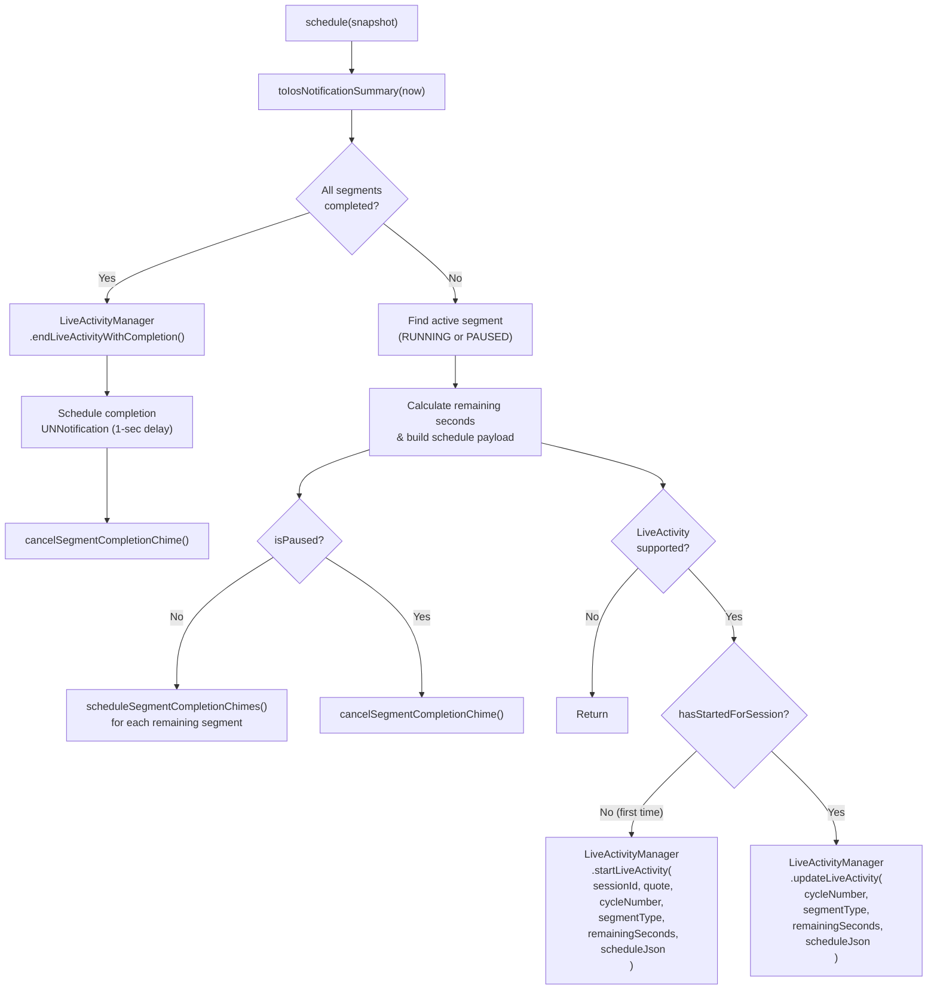

### iOS Segment Completion Chimes

Unlike Android's `AlarmManager`, iOS schedules **local notifications** via
`UNTimeIntervalNotificationTrigger` for each remaining segment in the session. These serve as audio
chimes to alert the user when a segment ends.

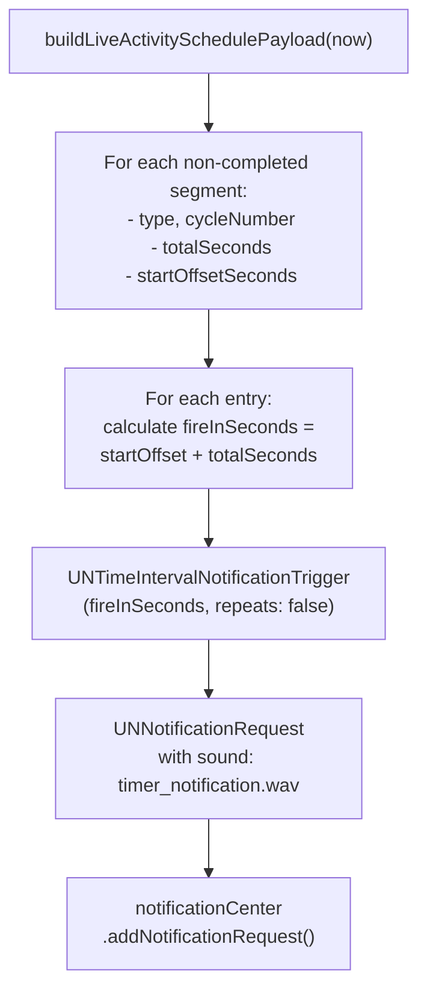

---

## JVM / Desktop

The JVM (Desktop) platform uses `NoOpPomodoroSessionNotifier`, which does nothing:

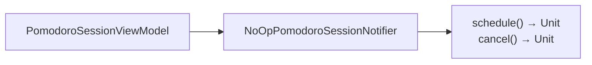

---

## DI Wiring

Dependency injection is handled via Koin with `expect/actual`:

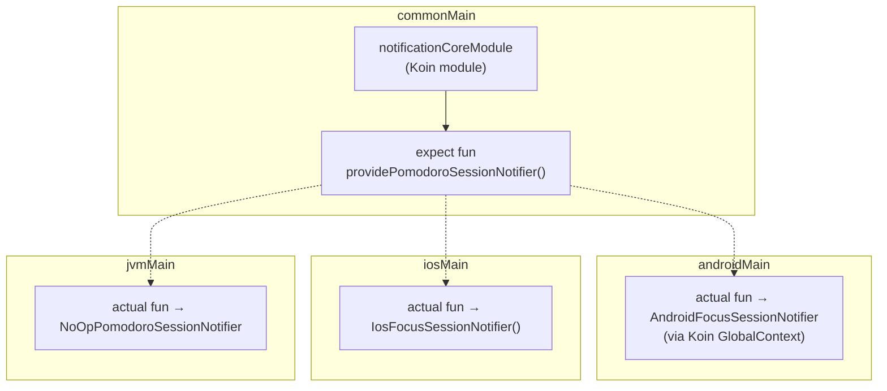

---

## Key Files Reference

| Layer   | File                                     | Purpose                                  |
|---------|------------------------------------------|------------------------------------------|
| Common  | `PomodoroSessionNotifier.kt`             | Interface: `schedule()` / `cancel()`     |
| Common  | `SoundPlayer.kt`                         | Interface for segment completion audio   |
| Common  | `CompletionSummaryMapper.kt`             | Maps session → completion summary        |
| Common  | `NotificationFeatureModules.kt`          | Koin DI wiring                           |
| Common  | `PomodoroSessionNotificationProvider.kt` | `expect fun` provider                    |
| Android | `AndroidFocusSessionNotifier.kt`         | Orchestrates notification + alarm        |
| Android | `NotifManager.kt`                        | Notification display interface           |
| Android | `DefaultPomodojoNotifManager.kt`         | Standard Android notification            |
| Android | `XiaomiNotifManager.kt`                  | Xiaomi Dynamic Island notification       |
| Android | `PomodojoAlarmManager.kt`                | Alarm scheduling interface               |
| Android | `AndroidPomodojoAlarmManager.kt`         | Exact alarm scheduling                   |
| Android | `NotificationSegmentProgressReceiver.kt` | BroadcastReceiver for alarm intents      |
| Android | `NotificationSummaryMapper.kt`           | Maps session → Android notification data |
| iOS     | `IosFocusSessionNotifier.kt`             | Live Activity + local notifications      |
| iOS     | `LiveActivityManager.kt`                 | Kotlin wrapper for Swift bridge          |
| iOS     | `LiveActivitySchedule.kt`                | Schedule payload builder                 |
| iOS     | `NotificationSummaryMapper.ios.kt`       | Maps session → iOS notification data     |
| JVM     | `PomodoroSessionNotifier.jvm.kt`         | No-op implementation                     |
| Feature | `PomodoroSessionViewModel.kt`            | Triggers `schedule()` / `cancel()`       |

---

## Known Issues

> ⚠️ **Progress Update Alarm Loop Bug**
>
> The `scheduleProgressUpdateAlarm()` in `AndroidPomodojoAlarmManager` is **currently disabled**
> (commented out). When enabled, it creates an infinite loop where each alarm trigger re-schedules
> itself, causing continuous notification updates. The alarm fires → receiver calls
> `notifier.schedule()` → which calls `alarmManager.schedule()` → which schedules another alarm →
> repeat.
>
> **TODO:** Re-draw the flowchart diagram of notification and alarm triggers to identify the
> correct fix. See comment in `AndroidPomodojoAlarmManager.kt:86-87`.
